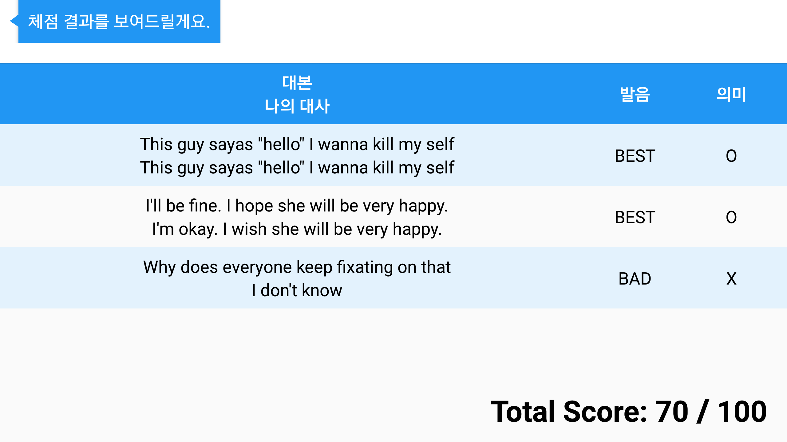

# Handy Tutor
Handy Tutor is an English conversation learning application using English video contents based on AI speaker.

## Screen SHot

# Handy Tutor Client

## API used

YouTube Android Player API
Clova Speech Recognition API
Clova Speech Synthesis API
Etri Pronunciation API

## Dependencies
<code>
 
    compile 'com.naver.speech.clientapi:naverspeech-sdk-android:1.1.1'
    compile 'com.android.support:recyclerview-v7:26.1.0'
    compile 'com.github.bumptech.glide:glide:4.3.1'
    annotationProcessor 'com.github.bumptech.glide:compiler:4.3.1'
    compile 'com.koushikdutta.ion:ion:2.+'
    compile files('libs/YouTubeAndroidPlayerApi.jar')
  </code>

